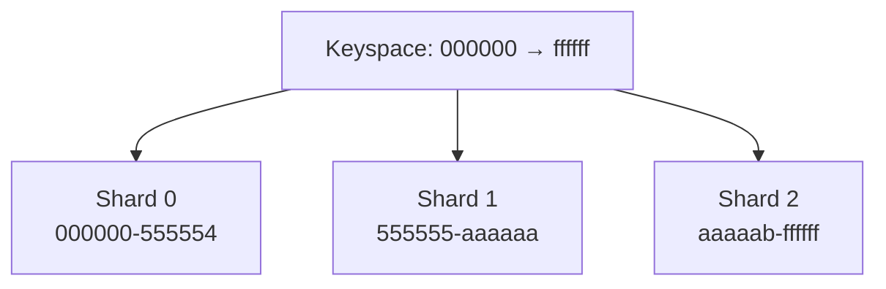
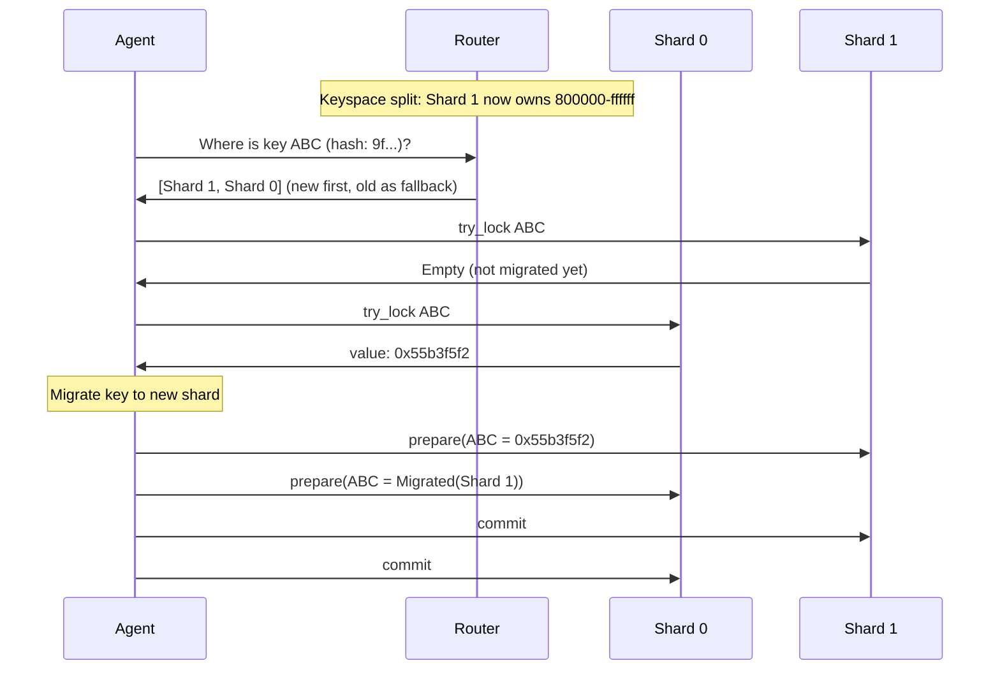
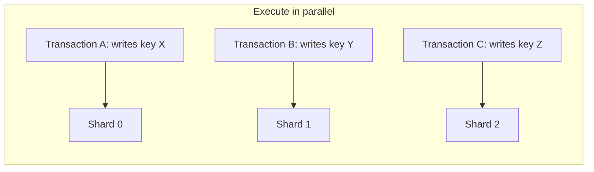
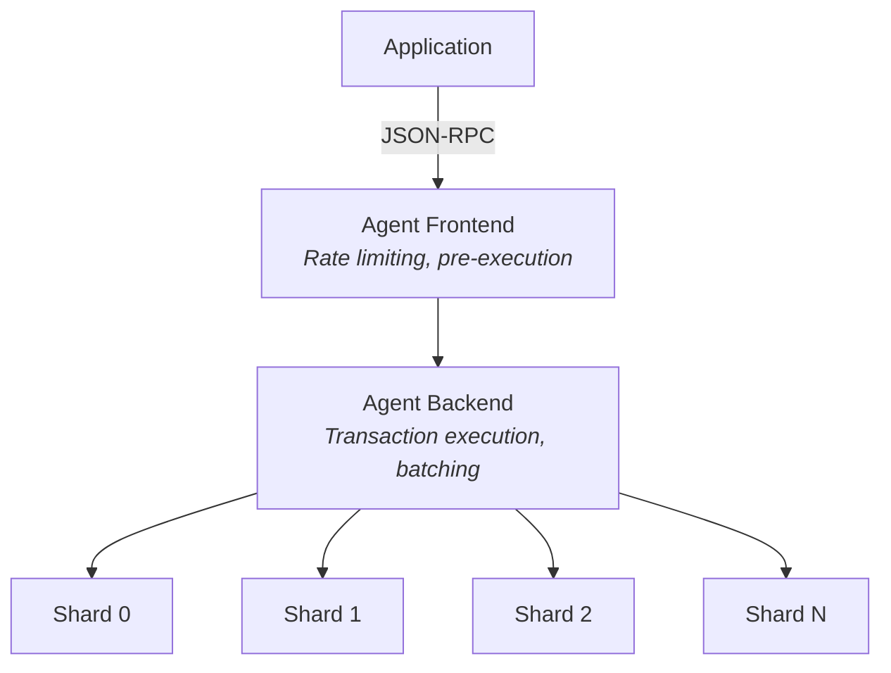
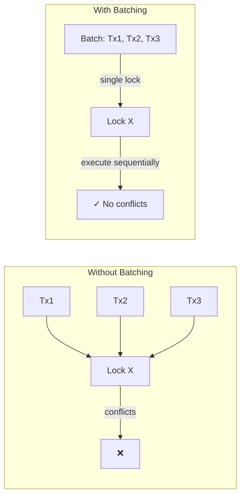

# Architected for Scale [2.5 million TPS tested. 200ms settlement. Linear scalability — every addition of compute makes the system faster.]

## Performance Numbers

| Metric | Value |
|--------|-------|
| **Throughput** | 2.5M TPS (tested) |
| **Settlement** | 200ms |
| **Transaction cost** | 0.0001 SBC |
| **Finality** | Immediate |

These aren't theoretical limits — they're demonstrated capabilities under load testing.

## Linear Scalability

Traditional blockchains hit throughput ceilings. Adding more nodes doesn't help because every node must process every transaction. Radius takes a different approach: sharded state with parallel execution.

### The Sharding Model

Radius distributes state across multiple independent shard clusters:

Each shard:
- Runs as a 3-node Raft cluster (tolerates 1 node failure)
- Stores a partition of the global state
- Processes transactions independently of other shards

### Why This Scales Linearly

| Shards | Keyspace per shard | Throughput |
|--------|-------------------|------------|
| 1 | 100% | 1x |
| 2 | 50% each | ~2x |
| 4 | 25% each | ~4x |
| N | 1/N each | ~Nx |

Double the shards, approximately double the throughput for non-conflicting workloads. The system supports up to **16.7 million shards** (24-bit shard indexing).

## How Sharding Works

### State Partitioning

Keys are hashed and distributed across shards via a prefix tree. When the system scales:

1. New shard cluster starts
2. Routing table updates with new keyspace assignment
3. Keys migrate lazily on first access
4. Old shard forwards lookups to new location

### Zero-Downtime Scaling

Scaling operations happen without interrupting service:

### Parallel Execution

Transactions accessing different keys execute simultaneously. No global ordering required:

Only transactions touching the same keys require coordination.

## The Architecture

Radius uses a distributed architecture based on [PArSEC](https://dci.mit.edu/s/p.pdf) (Parallel Sharded Transactions with Contracts):

### Why No Blocks?

Traditional blockchains batch transactions into blocks for consensus and propagation. Radius eliminates these constraints:

| Aspect | Blockchain | Radius |
|--------|------------|--------|
| Consensus | Global (all nodes agree on block) | Per-shard (Raft replication) |
| Ordering | Sequential (one block at a time) | Parallel (independent shards) |
| Propagation | Broadcast blocks to all nodes | Direct writes to relevant shards |
| Finality | Probabilistic (wait for confirmations) | Immediate |

### Per-Shard Consensus

Instead of global consensus on a block of transactions, Radius achieves consensus per-shard using Raft. Each shard independently replicates its state changes. This means:

- No mining or proof-of-work
- No validator coordination overhead
- No block production delays
- Immediate finality once Raft commits

## Congestion Control

When multiple transactions compete for the same key, Radius uses intelligent batching:

1. **Detection**: Shards track which keys cause transaction conflicts
2. **Routing**: Frontend routes conflicting transactions to the same backend
3. **Batching**: Backend executes conflicting transactions sequentially within a single batch
4. **Efficiency**: One lock acquisition serves the entire batch

## Specialized Shards

Radius supports heterogeneous shard configurations for different access patterns:

| Shard Type | Purpose | Use Case |
|------------|---------|----------|
| **Regular** | General state storage | Default workloads |
| **Receipt** | Transaction receipts | Append-heavy, read-light |
| **Edge** | Specific contracts/keys | High-traffic contracts |

Edge shards allow routing high-traffic contracts to dedicated infrastructure without affecting the rest of the system.

## Live Metrics

Track real-time network performance:

- [Dashboard →](https://dashboard.radiustech.xyz/) — Live TPS, settlement times, shard health

## Load Test Results

Performance validated under production-like conditions:

| Test | Configuration | Result |
|------|--------------|--------|
| Sustained throughput | 32 shards, mixed workload | 2.5M TPS |
| Settlement latency | P99 under load | under 200ms |
| Scaling linearity | 1-32 shards | ~30x throughput |

## Compared to Other Approaches

| Approach | Scaling Method | Consistency | Complexity |
|----------|---------------|-------------|------------|
| **L1 Blockchain** | Vertical (bigger nodes) | Global ordering | Low |
| **Rollups/L2** | Multiple chains | Bridge-dependent | High |
| **Radius** | Horizontal (add shards) | Per-shard consensus | Transparent |

## Next Steps

- [Designed for the Internet of Tomorrow](/differentiators/designed-for-internet-of-tomorrow) — EVM compatibility and differences
- [JSON-RPC API](/developer-resources/json-rpc-api) — Complete API reference
- [Quick Start](/build-deploy/quick-start-first-payment) — Get from zero to first transaction
